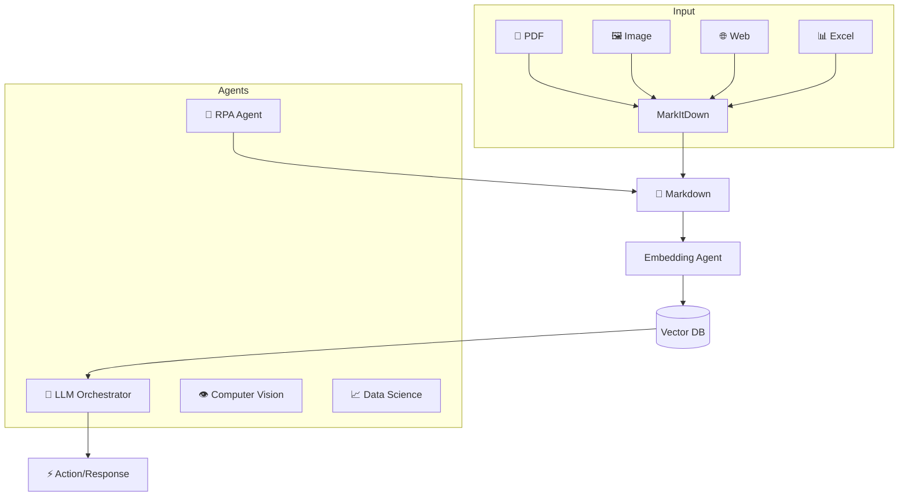
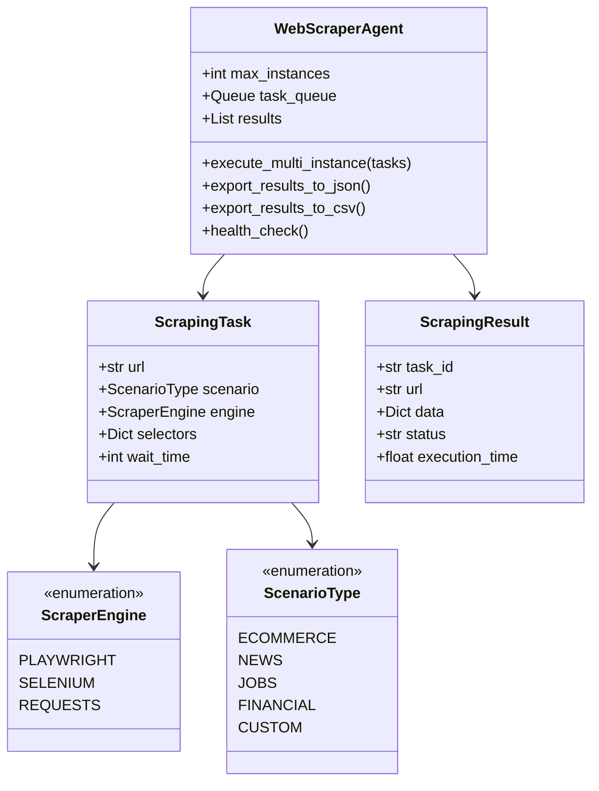
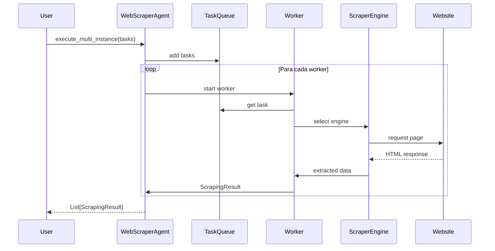

# 🤖 MultiAgent Platform

<div align="center">


**Plataforma de Orquestração Inteligente de Agentes com LLMs**

*Transform any data into actionable knowledge*

[Documentação](#-documentação) • [Instalação](#-instalação) • [Uso Rápido](#-uso-rápido) • [Arquitetura](#-arquitetura) • [Contribuição](#-contribuição)

</div>

---

## 📋 Índice

- [Visão Geral](#-visão-geral)
- [Características](#-características)
- [Arquitetura](#-arquitetura)
- [Instalação](#-instalação)
- [Agentes Disponíveis](#-agentes-disponíveis)
- [Dashboard de Monitoramento](#-dashboard-de-monitoramento)
- [Problemas Enfrentados e Soluções](#-problemas-enfrentados-e-soluções)
- [Diagramas](#-diagramas)
- [API Reference](#-api-reference)
- [Contribuição](#-contribuição)
- [Licença](#-licença)

---

## 🌟 Visão Geral

O **MultiAgent Platform** é uma plataforma SaaS/AI de nível empresarial para orquestração inteligente de múltiplos agentes especializados. Desenvolvido para transformar qualquer tipo de dado em conhecimento acionável.

### Conceito Central

```
📄 Anything → 📝 MarkItDown → 🧠 Intelligence → ⚡ Action
```

O Markdown é o formato canônico universal que conecta todas as operações.

### Dores que Resolve

| Problema | Solução MultiAgent |
|----------|-------------------|
| **Dados fragmentados** | Conversão unificada para Markdown |
| **Scraping manual** | Agentes RPA automatizados |
| **Múltiplos LLMs** | Orquestrador inteligente com roteamento |
| **Falta de observabilidade** | Dashboard em tempo real |
| **Escalabilidade** | Multi-instância paralela |
| **Retry manual** | Auto-healing automático |

---

## ✨ Características

### Core Features

- 🔄 **Multi-Instance Execution**: Até 10 workers paralelos
- 🤖 **8 Agentes Especializados**: RPA, LLM, CV, Data Science, etc.
- 📊 **Dashboard Real-Time**: Monitoramento visual WebSocket
- 🛡️ **Auto-Healing**: Retry logic com exponential backoff
- 📝 **MarkItDown Engine**: Conversão universal para Markdown
- 🔍 **Embeddings Vetoriais**: Busca semântica com Qdrant
- 📈 **Observabilidade**: Logs estruturados e métricas

### Engines de Scraping

| Engine | Uso | Performance |
|--------|-----|-------------|
| **Playwright** | Sites JavaScript modernos | ⭐⭐⭐⭐ |
| **Selenium** | Compatibilidade universal | ⭐⭐⭐ |
| **Requests** | Sites estáticos | ⭐⭐⭐⭐⭐ |

---

## 🏗️ Arquitetura

### Estrutura do Projeto

```
mult-agent/
├── app/
│   ├── agents/                    # Agentes especializados
│   │   ├── computer_vision/       # Processamento de imagem
│   │   ├── data_science/          # Análise de dados
│   │   ├── embedding/             # Vetorização
│   │   ├── llm_orchestrator/      # Orquestração LLM
│   │   ├── markitdown/            # Conversão Markdown
│   │   ├── observability/         # Monitoramento
│   │   ├── rpa/                   # Web scraping/automation
│   │   │   ├── web_scraper.py     # Agente principal
│   │   │   └── invoice_processor.py
│   │   └── specialist/            # Agentes especializados
│   ├── api/                       # REST API FastAPI
│   ├── dashboard/                 # Interface visual
│   │   └── web_monitor.py         # Dashboard WebSocket
│   ├── data/                      # Dados processados
│   ├── docs/                      # Documentação
│   ├── docker/                    # Containerização
│   ├── pipelines/                 # Pipelines de dados
│   └── vector_db/                 # Banco vetorial
├── logs/                          # Logs de execução
├── output/                        # Resultados exportados
├── requirements_rpa.txt           # Dependências RPA
├── run_web_scraper.py             # Runner interativo
├── test_web_scraper.py            # Testes rápidos
└── README.md                      # Este arquivo
```

### Diagrama de Fluxo



---

## 💻 Instalação

### Requisitos

- Python 3.10+
- Node.js 18+ (para dashboard)
- Chrome/Chromium (para Playwright/Selenium)

### Instalação Rápida

```bash
# Clone o repositório
git clone https://github.com/seu-usuario/mult-agent.git
cd mult-agent

# Crie ambiente virtual
python -m venv venv
venv\Scripts\activate  # Windows
source venv/bin/activate  # Linux/Mac

# Instale dependências
pip install -r app/api/requirements.txt
pip install -r requirements_rpa.txt

# Instale Playwright browsers
playwright install chromium

# Configure variáveis de ambiente
copy .env.example .env
# Edite .env com suas API keys
```

### Variáveis de Ambiente

```env
# LLM APIs
OPENAI_API_KEY=sk-...
ANTHROPIC_API_KEY=sk-ant-...

# Vector DB
QDRANT_HOST=localhost
QDRANT_PORT=6333

# Dashboard
DASHBOARD_PORT=8000
```

---

## 🤖 Agentes Disponíveis

### 1. RPA Web Scraper Agent

**Arquivo**: `app/agents/rpa/web_scraper.py`

O agente mais completo para automação web e extração de dados.

```python
from app.agents.rpa.web_scraper import WebScraperAgent, ScrapingTask, ScenarioType

# Criar agente com 10 instâncias paralelas
agent = WebScraperAgent(max_instances=10)

# Definir tarefas
tasks = [
    ScrapingTask(
        url="https://news.ycombinator.com/",
        scenario=ScenarioType.NEWS,
        selectors={"headline": ".titleline > a"}
    )
]

# Executar
results = await agent.execute_multi_instance(tasks)
```

**Cenários suportados**:
- 🛒 E-commerce (produtos, preços)
- 📰 News (artigos, headlines)
- 💼 Jobs (vagas, salários)
- 💰 Financial (stocks, crypto)
- 🎯 Custom (seletores personalizados)

### 2. LLM Orchestrator Agent

**Arquivo**: `app/agents/llm_orchestrator/agent.py`

Roteamento inteligente entre múltiplos LLMs.

```python
from app.agents.llm_orchestrator.agent import agent

# Executar com estratégia
result = await agent.route_and_execute(
    task="Analise este documento",
    context="...",
    strategy="quality"  # ou "speed", "balanced"
)
```

### 3. Embedding Agent

**Arquivo**: `app/agents/embedding/agent.py`

Vetorização de documentos para busca semântica.

### 4. MarkItDown Agent

**Arquivo**: `app/agents/markitdown/agent.py`

Conversão universal para Markdown.

### 5. Computer Vision Agent

**Arquivo**: `app/agents/computer_vision/agent.py`

Processamento de imagens e OCR.

### 6. Data Science Agent

**Arquivo**: `app/agents/data_science/agent.py`

Análise estatística e ML.

### 7. Observability Agent

**Arquivo**: `app/agents/observability/agent.py`

Métricas e monitoramento.

### 8. Specialist Agent

**Arquivo**: `app/agents/specialist/agent.py`

Agentes especializados por domínio.

---

## 📊 Dashboard de Monitoramento

### Iniciar Dashboard

```bash
python -m app.dashboard.web_monitor
```

Acesse: **http://localhost:8000**

### Recursos do Dashboard

- 📈 Métricas em tempo real (WebSocket)
- 📋 Histórico de tarefas
- 🔧 Status de workers
- 📊 Gráficos de performance
- ⚠️ Alertas de erro

---

## 🔧 Problemas Enfrentados e Soluções

### Problema 1: Import Circular

**Descrição**: Erro de importação circular entre módulos de agentes.

**Solução**: 
- Reestruturação dos `__init__.py`
- Lazy imports onde necessário
- Separação clara de responsabilidades

### Problema 2: Timeout em Sites JavaScript

**Descrição**: Playwright falhava em sites com muito JS.

**Solução**:
```python
# Implementado wait_until="networkidle"
await page.goto(url, wait_until="networkidle", timeout=30000)

# Scroll progressivo para lazy loading
await self._scroll_page(page)
```

### Problema 3: Rate Limiting de APIs

**Descrição**: Bloqueio por excesso de requests.

**Solução**:
```python
# Exponential backoff com tenacity
@retry(
    stop=stop_after_attempt(3),
    wait=wait_exponential(multiplier=1, min=2, max=10)
)
async def scrape():
    pass
```

### Problema 4: Detecção de Bot

**Descrição**: Sites bloqueavam scrapers automáticos.

**Solução**:
- User-Agent rotation
- Headers customizados
- Comportamento humano (scroll, waits)
- Suporte a proxies

### Problema 5: Memory Leak com Browsers

**Descrição**: Chrome consumia muita memória.

**Solução**:
```python
# Context manager com cleanup garantido
async with async_playwright() as p:
    browser = await p.chromium.launch()
    try:
        # operações
    finally:
        await browser.close()  # sempre fecha
```

---

## 📐 Diagramas

### Diagrama de Classes - Web Scraper



### Diagrama de Sequência - Scraping Flow



---

## 📚 API Reference

### WebScraperAgent

```python
class WebScraperAgent:
    """
    Agente RPA para web scraping multi-instância.
    
    Args:
        max_instances (int): Número máximo de workers paralelos. Default: 5
    
    Methods:
        execute_multi_instance(tasks): Executa lista de tarefas em paralelo
        export_results_to_json(filename): Exporta resultados para JSON
        export_results_to_csv(filename): Exporta resultados para CSV
        health_check(): Retorna status do agente
    """
```

### ScrapingTask

```python
@dataclass
class ScrapingTask:
    """
    Definição de tarefa de scraping.
    
    Attributes:
        url (str): URL alvo para scraping
        scenario (ScenarioType): Tipo de cenário (NEWS, ECOMMERCE, etc)
        engine (ScraperEngine): Engine a usar (PLAYWRIGHT, SELENIUM, REQUESTS)
        selectors (Dict): CSS selectors customizados
        wait_time (int): Tempo de espera em ms. Default: 5000
        scroll_to_bottom (bool): Se deve rolar página. Default: False
    """
```

---

## 🧪 Testes

### Executar Teste Rápido

```bash
python test_web_scraper.py
```

### Executar Runner Interativo

```bash
python run_web_scraper.py
```

---

## 🤝 Contribuição

1. Fork o projeto
2. Crie branch de feature (`git checkout -b feature/nova-feature`)
3. Commit suas mudanças (`git commit -m 'Adiciona nova feature'`)
4. Push para branch (`git push origin feature/nova-feature`)
5. Abra Pull Request

### Padrões de Código

- **Python**: PEP8, Black formatter
- **Docstrings**: Google style
- **Commits**: Conventional Commits
- **Testes**: pytest

---

## 📄 Licença

Este projeto está licenciado sob a MIT License - veja [LICENSE](LICENSE) para detalhes.

---

## 👥 Autores

- **MultiAgent Platform Team**

---

<div align="center">

**⭐ Se este projeto foi útil, considere dar uma estrela! ⭐**

Made with ❤️ by MultiAgent Platform Team

</div>
