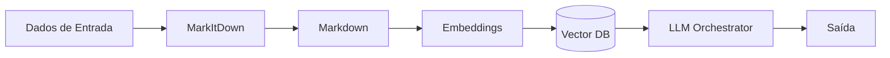

# Arquitetura do Sistema

## Visão Geral

O MultiAgent Platform segue uma arquitetura modular baseada em agentes especializados que se comunicam através de um barramento central.

## Componentes Principais

### 1. Camada de Agentes (`app/agents/`)

```
┌─────────────────────────────────────────────────────────────┐
│                     AGENT LAYER                             │
├─────────────┬─────────────┬─────────────┬─────────────────┤
│ RPA Agent   │ LLM Agent   │ CV Agent    │ Data Science    │
│             │             │             │                 │
│ • Scraping  │ • GPT-4     │ • OCR       │ • Analytics     │
│ • Automation│ • Claude    │ • Detection │ • ML Models     │
│ • Forms     │ • Ollama    │ • Classify  │ • Viz           │
└─────────────┴─────────────┴─────────────┴─────────────────┘
```

### 2. Camada de Dados (`app/data/`)

Armazena dados processados em formato Markdown (canônico).

### 3. Camada de API (`app/api/`)

REST API FastAPI para acesso externo.

### 4. Dashboard (`app/dashboard/`)

Interface visual WebSocket para monitoramento.

## Fluxo de Dados



## Padrões de Design

### 1. Worker Pattern
Usado no RPA Agent para execução paralela.

### 2. Strategy Pattern
Usado no LLM Orchestrator para seleção de modelo.

### 3. Factory Pattern
Usado na criação de engines de scraping.

## Comunicação

- **Síncrona**: REST API
- **Assíncrona**: WebSocket (dashboard)
- **Interna**: async/await Python
